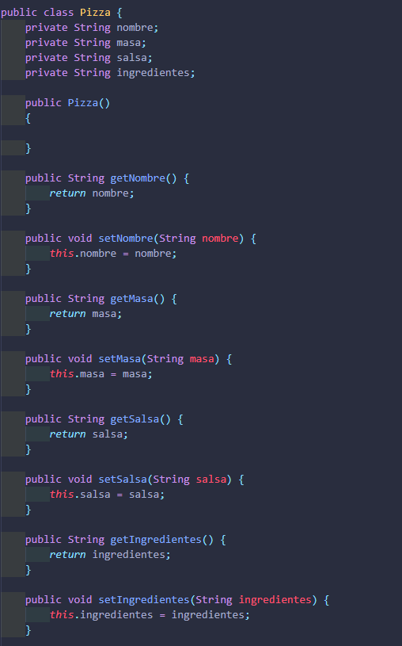

# Patron_de_Dise-o_Builder
patron de diseño Builder Pizza

### Una de las primeras clases que se debe crear es la clase llamada pizza dentro de ella obtendremos todos los valores necesarios para compartirse y tener los argumentos de gets y set, donde todos retornaran el valor que sea necesario.

### Luego procede la creacion de un public to string pero este se crea cuando las demas clases ya esten termiandas y pasen sus datos para las diferentes Pizzas

## Creacion de la clase Pizza Builder 
### la creacion de esta clase nos permitira poder hacer la creacion de nuevas pizzas en base a las clases que le compartamos, dentro de ella podremos crear los arguementos de su nombre, su salsa, su masa e ingredientes que esta contenga.

## Creacion de la clase barbacoaPizzabuilder
### En esta clase se realizara la creacion de cada uno de los ingredientes que son necesarios para la elaboracion de una pizzaBarbacoa, solamente utilizada como referencia, una clase que se entiende desde la clase de tipo pizzaBuilder

## Creacion de la clase PizzaCarbonera
### Las caracteristicas o datos que se pueden mostrar en esta clase son exactamente iguales a la clase anterior solo que cond atos de retorno distintos.

## Se crea la clase Cocineri
### LA elaboracion de dicha clase se realiza para poder atribuir todos los tipos de nuevas pizzas que se vayan a crear por el cocinero tomando asi los valores de la pizza ya creada anteriormente sea de tipo barbacoa o carbonada.
